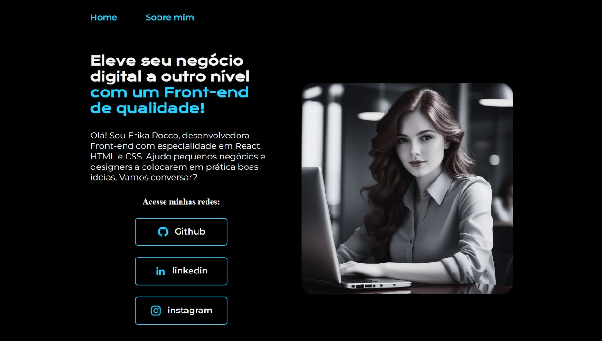

# Portfólio Erika Rocco

Este é um projeto de portfólio pessoal desenvolvido com HTML e CSS, com foco em navegação entre links e design responsivo. O objetivo é apresentar as habilidades de Erika Rocco, uma desenvolvedora Front-end especializada em React, HTML e CSS.

## Funcionalidades

- **Navegação entre páginas:** Links para "Home" e "Sobre mim".
- **Links externos:** Integração com GitHub, LinkedIn e Instagram.
- **Design responsivo:** Layout adaptável para diferentes tamanhos de tela.
- **Efeitos interativos:** Hover nos botões e links para melhorar a experiência do usuário.

## Ferramentas utilizadas

  
  
  

## Feito por:

### Talita Magalhães

### Linkedin: [https://www.linkedin.com/talitamagalhaes/](https://www.linkedin.com/in/talitamagalh%C3%A3es/)
